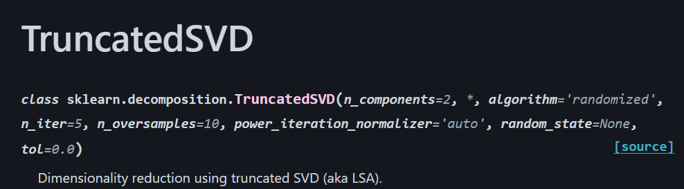

## Mathematical Framework

- **Start from the full SVD**
  - Any real matrix $A \in \mathbb{R}^{m \times n}$ can be decomposed into

    $$
    A = U \Sigma V^\top
    $$

  - $U$: left singular vectors, $m \times m$ (orthonormal)  
    $V$: right singular vectors, $n \times n$ (orthonormal)
  - $\Sigma$: diagonal with singular values $\Sigma_{1} \ge \cdots \ge \Sigma_r > 0$

- **Idea behind truncation**
  - Singular values often decay rapidly in real data.
  - Only the leading components are needed.

- **Definition of TSVD**
  - Partition:

    $$
    A = U_k \Sigma_k V_k^\top + U_{>k} \Sigma_{>k} V_{>k}^\top
    $$

  - The truncated rank-$k$ approximation:

    $$
    A_k = U_k \Sigma_k V_k^\top
    $$

  - In other words: we keep the first $k$ diagonal entries of $\Sigma$ and discard the rest.
  - We then plug this $\Sigma_k$ back into $U \Sigma_k V^\top = A$ in order to obtain $A_k$, the dimensionally reduced version of $A$ with $k$ dimensions. 

Note: expand more on the math behind this decomposition. 

## Worked Example

Go through the following: 




- **Important components of this function:**
  - n_compontents: Desired dimensionality of output.
  - n_iter: number of iterations of random svd solver.  Default is 5.  Recommend increasing it if your matrix may be sparse, and/or has a slowly decaying variability in its components. 
  - random_state: Random number seed to use for randomized SVD.

```{julia}
#| eval: false
from sklearn.decomposition import TruncatedSVD
from scipy.sparse import csr_matrix
import numpy as np
np.random.seed(0)
X_dense = np.random.rand(100, 100)
X_dense[:, 2 * np.arange(50)] = 0
X = csr_matrix(X_dense)
svd = TruncatedSVD(n_components=5, n_iter=7, random_state=42)
svd.fit(X)
print(svd.explained_variance_ratio_)
print(svd.explained_variance_ratio_.sum())
print(svd.singular_values_)
```


- **How to intepret outputs:**
  - Like PCA, we can look at the individual components of our data by doing $A_d = U_k \Sigma_d V_k^\top$, where $d$ is the dimension or component we want to look along. 
  - Unlike PCA however, we can also compare $A_k$ to $A$, in order to see what $A$ looks like with all of the noise removed.  


## Strengths, Limitations, and Appropriate Use cases 


- **Strengths:**
  - Improving interpretability: By looking along each dimension, or by looking at the reduced data, we can sometimes improve the interpretability of our data or the trends within it, much like PCA. 
  - Noise filtering: If you suspect your data might be noisy, TSVD is an effective way to find trends outside of that.
  - Stabilization of ill-posed problems: TSVD can regularize data in order to stop small background values from blowing things up or causing too much chaos. 

- **Limitations:**
  - Hard truncation can remove important data 
  - Relevant to previous point: TSVD is sensitive to our choice in k
  - TSVD assumes a linear subspace structure: not suitable for non-linear subspaces
  - Sensitive to outliers: TSVD is good for sparse matrices, but NOT for matrices with one or two unique outliers.  In other words, good if you only have a few extreme storms, NOT GOOD if you only have one very extreme storm. 

- **Appropriate Use Cases:**
  - Denoising Radar or gridded precipitation 
  - Uncovering dominant rainfall patterns, like El Nino/La Nina
  - Identifying low-rank structures or trends in extreme event ensembles 


## Connections to Course Themes 

Students should think about the knowledge they gained in this lecture of TSVD as an upgrade or addition to their existing knowledge of PCA.  If they feel like PCA would be well suited to an application, but they also think that their matrix might be sparse, such as if they're looking at a few extreme storms seperated by long periods of time, or if they want the option to look at the dimensionally reduced data all in a single view, or if they think that reducing noise in their data might improve the perfomance in their model, they should consider TSVD. 


## Citations and Bibliography 

Singular Value Decomposition (SVD): Overview. Directed by Steve Brunton, 2020. YouTube, https://www.youtube.com/watch?v=gXbThCXjZFM.

Truncated SVD and Its Applications. https://langvillea.people.charleston.edu/DISSECTION-LAB/Emmie%27sLSI-SVDModule/p5module.html. Accessed 14 Nov. 2025.

“TruncatedSVD.” Scikit-Learn, https://scikit-learn/stable/modules/generated/sklearn.decomposition.TruncatedSVD.html. Accessed 14 Nov. 2025.

“Unveiling the Hidden Gems: Exploring Important Features with Truncated SVD and PCA.” DEV Community, 20 May 2023, https://dev.to/elldora/unveiling-the-hidden-gems-exploring-important-features-with-truncated-svd-and-pca-22j6.


